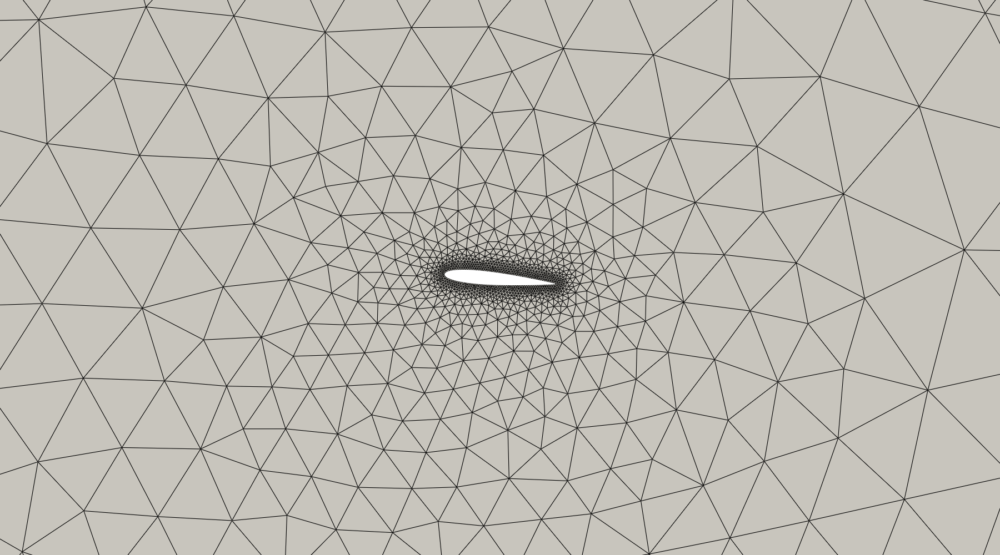
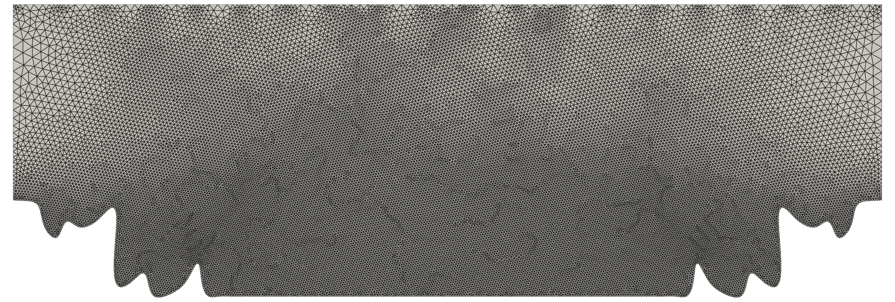
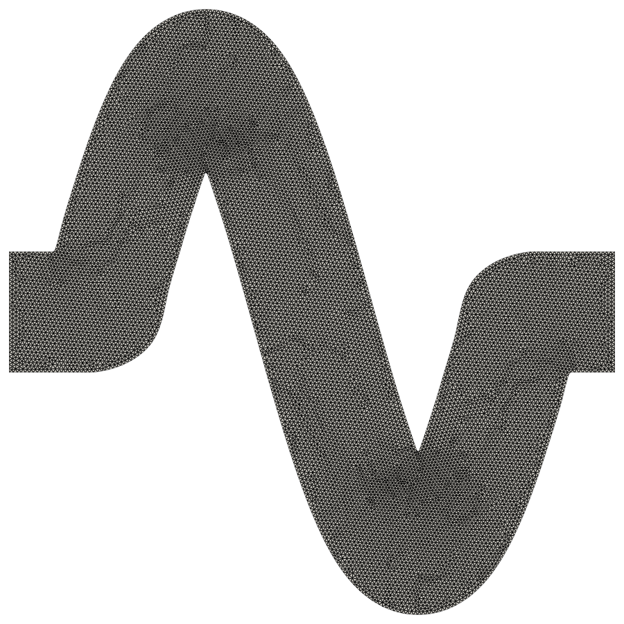
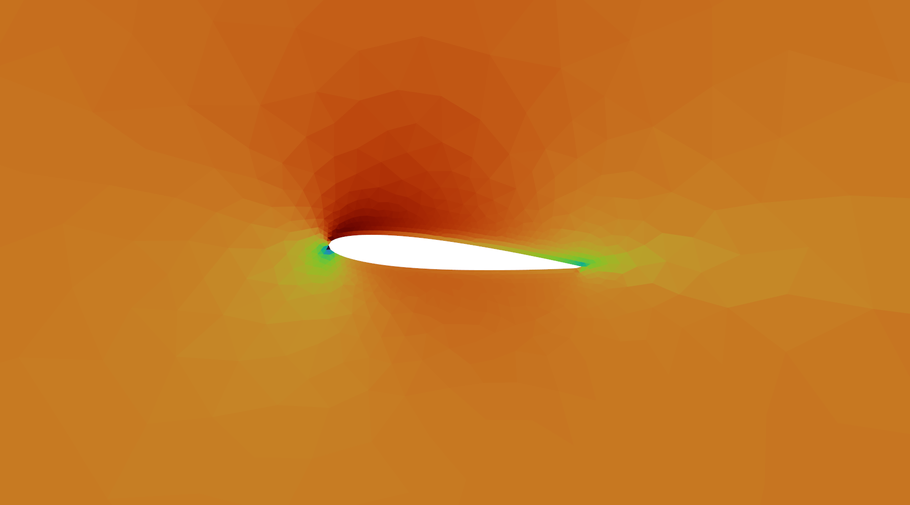
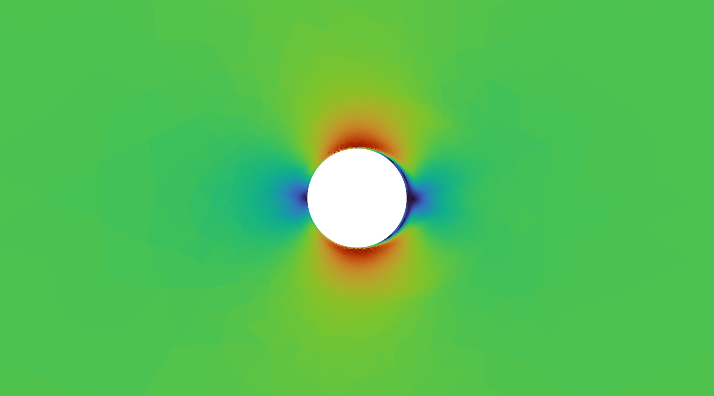

# AutoFoam-Lite

**Natural language → Mesh → CFD simulation → Results, on any consumer GPU.**

AutoFoam-Lite is a lightweight, autonomous OpenFOAM agent that converts a plain-English description of a CFD problem into a complete, convergent OpenFOAM v2412 case — with no manual meshing, no hand-written dictionaries, and no solver tuning.

Unlike prior LLM-CFD approaches that required 14B+ parameter models and high-end server GPUs, AutoFoam-Lite runs the full pipeline on a **3B parameter model with 4-bit quantisation** — fitting in **≈ 2 GB VRAM** while achieving a **15/15 cross-check pass rate** at an average score of **0.87**.

> **Paper:** *AutoFOAM: The Self-Refining Autonomous OpenFOAM Agent* — Arun Govind Neelan & A Seshaditya  
> **Dataset:** [AGN000/FoamAgentCases](https://github.com/AGN000/FoamAgentCases)

## Demo

[](https://www.youtube.com/watch?v=xsWYk7X7F9A)

---

## Why Lightweight?

| | AutoFoam-Lite | Prior approach |
|---|---|---|
| Model size | 3B (4-bit NF4) | 14B (bf16) |
| VRAM required | **≈ 2 GB** | ≈ 28 GB |
| GPU needed | Any CUDA GPU | A100 / H100 |
| Cross-check pass rate | **15 / 15** | 11 / 15 |
| Average score | **0.87** | 0.84 |
| Inference time per case | ~5 s | ~15 s |

The 3B base model (`Qwen2.5-Coder-3B-Instruct`) downloads automatically from HuggingFace on first run. No licence or API key required.

---

## Benchmark — 15-Case Cross-Check

| # | Case | Score | Solver |
|---|---|---|---|
| 1 | LDC laminar (Re=100) | 0.82 | simpleFoam |
| 2 | LDC mid-Re (Re=1000) | 0.88 | simpleFoam |
| 3 | Channel laminar (Re=500) | 0.82 | simpleFoam |
| 4 | Pipe turbulent (Re=5000, k-ω SST) | 0.87 | simpleFoam |
| 5 | Pipe 3D (Re=3000) | 0.89 | simpleFoam |
| 6 | Cylinder 2D (Re=200) | 0.83 | simpleFoam |
| 7 | Sphere 3D laminar (Re=300) | 0.82 | simpleFoam |
| 8 | Backward-facing step (Re=800) | 0.90 | simpleFoam |
| 9 | NACA 0012 airfoil (Re=500k, AoA 5°) | 0.90 | simpleFoam |
| 10 | Planar diffuser (Re=1000) | 0.87 | simpleFoam |
| 11 | Turbulent channel (Re=10000, k-ω SST) | 0.89 | simpleFoam |
| 12 | Natural convection cavity (ΔT=50 K) | 0.87 | buoyantSimpleFoam |
| 13 | Compressible channel (Ma=0.5) | 0.90 | rhoSimpleFoam |
| 14 | 3D box flow (Re=200) | 0.90 | simpleFoam |
| 15 | Axisymmetric pipe (Re=1000, wedge) | 0.90 | simpleFoam |

**15 / 15 pass (score ≥ 0.80) — average 0.87**

---

## Automatically Generated Meshes

All meshes are built fully autonomously from a single natural-language prompt via the `gmsh` OCC API — zero manual CAD.

| NACA 0012 Airfoil | Cylinder in Cross-flow |
|:---:|:---:|
|  |  |

| Periodic Hill | S-bend Duct |
|:---:|:---:|
|  |  |

## Velocity Contours

| NACA 0012 Airfoil | Cylinder in Cross-flow |
|:---:|:---:|
|  |  |

| Periodic Hill | S-bend Duct |
|:---:|:---:|
|  |  |

---

## Supported Geometries and Solvers

### Geometries (12 types)

The geometry is selected automatically from the prompt. Each type has a dedicated parametric mesh builder using the gmsh OCC API.

| # | Geometry | Key Parameters | Typical Use |
|---|---|---|---|
| 1 | **Box** | length, width, height | 3D enclosure, box flow |
| 2 | **Channel** | length, width | 2D duct / channel flow |
| 3 | **Lid-driven cavity** | side length | Classic recirculating flow benchmark |
| 4 | **Cylinder** | diameter, domain size | Bluff-body external flow, wake studies |
| 5 | **Pipe** | diameter, length | Internal pipe flow (2D/3D) |
| 6 | **Backward-facing step** | step height, expansion ratio | Flow separation and reattachment |
| 7 | **Airfoil (NACA 4-digit)** | chord, angle of attack | Aerodynamic lift/drag, boundary layers |
| 8 | **Sphere** | diameter | 3D external flow with boundary-layer mesh |
| 9 | **Wedge (axisymmetric)** | diameter, length | Axisymmetric pipe flow with wedge BCs |
| 10 | **Periodic hill** | hill height, spacing | Separated turbulent flow benchmark |
| 11 | **S-bend** | pipe diameter, bend radius | Internal flow with double curvature |
| 12 | **Diffuser** | inlet/outlet width, length | Adverse pressure gradient, flow expansion |

> **Prompt tip:** You do not need to name the geometry. Just describe the flow — e.g. *"2D flow over a cylinder Re=200, water, diameter 0.1 m"* — and the agent picks the correct type automatically.

---

### Solvers (8 — automatically selected)

The solver is chosen deterministically from the physics keywords in your prompt. No manual selection required.

| Solver | When it is used | Physics |
|---|---|---|
| `simpleFoam` | Default for steady incompressible flow | Steady RANS, incompressible |
| `icoFoam` | Transient + laminar + Re < 2300 | Transient laminar, incompressible |
| `pimpleFoam` | Transient + turbulent or Re ≥ 2300 | Transient RANS/LES, incompressible |
| `rhoSimpleFoam` | Compressible + steady | Steady compressible (subsonic–transonic) |
| `rhoPimpleFoam` | Compressible + transient | Transient compressible |
| `buoyantSimpleFoam` | Heat transfer / natural convection + steady | Steady buoyancy-driven flow |
| `buoyantPimpleFoam` | Heat transfer / natural convection + transient | Transient buoyancy-driven flow |
| `interFoam` | Two-phase / multiphase / VOF | Free-surface and multiphase flow |

**Selection rules (in priority order):**
1. Keywords like `VOF`, `two-phase`, `multiphase` → `interFoam`
2. Keywords like `Mach`, `compressible`, `supersonic` → `rhoSimpleFoam` / `rhoPimpleFoam`
3. Keywords like `heat transfer`, `natural convection`, `hot wall`, `ΔT` → `buoyantSimpleFoam` / `buoyantPimpleFoam`
4. Keywords like `transient`, `time-dependent`, `unsteady` → `icoFoam` (laminar) or `pimpleFoam` (turbulent)
5. Everything else → `simpleFoam`

---

### Turbulence Models (2)

| Model | Keyword in prompt | Notes |
|---|---|---|
| Laminar | *(default for low Re)* | Used automatically when Re < 2300 |
| k-ω SST | `k-omega SST`, `kOmegaSST`, `turbulent` | Default for all turbulent flows |

---

## Features

### 8-Stage Pipeline
```
Prompt → Parameter extraction (LLM)
       → Solver selection (rule-based, deterministic)
       → Numerical policy (y⁺-aware schemes & relaxation)
       → Mesh generation (gmsh OCC API)
       → Case writing (OpenFOAM dict templates)
       → Simulation (subprocess)
       → Scoring + self-correction (Layer-1 retry)
```

### Self-Evolution Loop (7 Layers)
The agent improves itself from its own runs — no human labelling required.

| Layer | What it does |
|---|---|
| **L1 — Self-correct** | Detects divergence / FATAL / mass-imbalance; retries with enriched failure context |
| **L2 — Curate** | Deduplicates and score-filters the attempt log; emits training JSONL |
| **L3 — SFT** | QLoRA fine-tuning epoch + bf16 merge |
| **L4 — DPO** | Preference learning on (prompt, chosen, rejected) retry pairs |
| **L5 — Anchor mix** | Preserves 30 % of v1 corpus each cycle to prevent forgetting |
| **L6 — Active learning** | Targets weakest solver family; synthesises new adversarial prompts |
| **L7 — Regression gate** | Blocks promotion if any prompt regresses > 0.10 vs pinned baseline |

---

## Quick Start

### Option A — Docker (easiest)

```bash
git clone https://github.com/AGN000/AutoFoam-Lite.git
cd AutoFoam-Lite

# GPU
docker compose up --build

# CPU-only
docker compose --profile cpu up --build
```

Open **http://localhost:7861**

> The model downloads automatically on first build (~2 GB, ~1 min on a fast connection).

### Option B — Conda

```bash
git clone https://github.com/AGN000/AutoFoam-Lite.git
cd AutoFoam-Lite

conda create -n autofoam python=3.10 -y
conda activate autofoam

# PyTorch — pick your CUDA version
pip install torch==2.6.0 torchvision==0.21.0 torchaudio==2.6.0 \
    --index-url https://download.pytorch.org/whl/cu124   # or /cpu for CPU-only

pip install -r requirements.txt
```

Set your OpenFOAM path in `openfoam_agent/config.py` line 6 if it differs from the default:
```python
OPENFOAM_BASHRC = "/usr/lib/openfoam/openfoam2412/etc/bashrc"
```

Build the RAG index once:
```bash
python scripts/index_tutorials.py
python scripts/index_knowledge_base.py
```

---

## Usage

### Web UI
```bash
conda activate autofoam
python -c "from openfoam_agent.ui import launch_ui; launch_ui()"
# Open http://localhost:7861
```

The UI provides:
- **Run Simulation** tab — prompt input, live score, residual convergence plot, field contours
- **Results Explorer** — browse and reload any past case
- **Train Model** — collect data and launch QLoRA fine-tuning
- **Tutorial Browser** — browse OpenFOAM tutorial cases

### Interactive REPL
```bash
conda activate autofoam
bash scripts/repl.sh
```
```
prompt> 2D lid-driven cavity Re=1000, water, 1m square
prompt> NACA0012 airfoil AoA 5 deg Re=1e6 chord=1m
prompt> turbulent pipe flow Re=50000 diameter=0.05m
prompt> quit
```

### One-off CLI run
```bash
conda activate autofoam
bash scripts/ask.sh "2D backward-facing step Re=800, water, step height 0.05m"
```

### Python API
```python
from openfoam_agent.agent import OpenFOAMAgent

agent = OpenFOAMAgent(use_llm=True)

result = agent.run(
    "turbulent pipe flow Re=5000, air, diameter 0.1m, k-omega SST",
    use_gmsh=True,
    max_retries=2,
    sim_timeout=300,
)

print(f"Score   : {result.score:.2f}")    # 0.0 – 1.0
print(f"Solver  : {result.solver}")        # e.g. simpleFoam
print(f"Case    : {result.case_dir}")      # OpenFOAM case directory
print(f"Feedback: {result.feedback}")      # scoring breakdown
```

### 15-case benchmark
```bash
conda activate autofoam
python scripts/cross_check_test.py

# Resume from case N after a crash:
START_FROM=7 python scripts/cross_check_test.py
```

---

## Docker Reference

```bash
# Start UI
docker compose up --build

# One-off simulation
docker compose run --rm autofoam-lite run "2D lid-driven cavity Re=1000"

# Interactive REPL
docker compose run --rm autofoam-lite repl

# 15-case cross-check
docker compose run --rm autofoam-lite crosscheck

# Build RAG index (first time)
docker compose run --rm autofoam-lite index

# Shell
docker compose run --rm autofoam-lite bash

# Use a larger model
docker compose build --build-arg MODEL_ID=Qwen/Qwen2.5-Coder-7B-Instruct
```

---

## Self-Evolution Loop

```bash
# Collect training data from seed prompts
python scripts/generate_training_data.py

# Full cycle: curate → QLoRA SFT → DPO → merge → eval gate → swap
bash scripts/evolve.sh

# Dry run (validates without swapping the model)
EVOLVE_DRY_RUN=1 bash scripts/evolve.sh
```

---

## Case Output

Every run writes a complete OpenFOAM case to `data/cases/`:

```
data/cases/case_<hash>_attempt0/
├── 0/           # initial conditions (U, p, k, omega, T, …)
├── constant/    # polyMesh + physical properties
├── system/      # controlDict, fvSchemes, fvSolution
└── agent.log    # checkMesh + solver residuals
```

Open in ParaView:
```bash
paraview data/cases/case_<hash>_attempt0/
```

---

## Configuration

| Variable | Default | Effect |
|---|---|---|
| `OPENFOAM_AGENT_LLM_OVERRIDE` | *(config.py)* | Use a different model without editing code |
| `USE_CPU_INFERENCE` | `0` | `1` = run on CPU (no GPU needed, slower) |
| `TORCHDYNAMO_DISABLE` | `1` | Disable torch.compile (recommended) |
| `VLLM_GPU_MEM_FRAC` | `0.90` | GPU memory fraction for the model |
| `RETRY_SCORE_THRESHOLD` | `0.7` | Score below this triggers Layer-1 retry |
| `MIN_RETRAIN_SCORE` | `0.65` | Floor score for training corpus |
| `START_FROM` | `1` | Resume cross-check from case N |

---

## Repository Layout

```
openfoam_agent/          # core package
├── agent.py             # 8-stage pipeline + retry orchestrator
├── param_extractor.py   # JSON-schema LLM → CFDParams
├── solver_selector.py   # deterministic solver rule table
├── numerical_policy.py  # y⁺-aware schemes and relaxation
├── case_writer.py       # OpenFOAM dict templates
├── gmsh_generator.py    # 12 parametric mesh builders (gmsh OCC)
├── runner.py            # solver subprocess + log parser
├── scorer.py            # multi-component reward function
├── self_correct.py      # Layer-1 failure diagnosis + retry context
├── dict_fix.py          # surgical FOAM-FATAL dict-level fix
├── rag.py               # ChromaDB retrieval + Stream-A context
├── training.py          # QLoRA / DPO trainer factory
├── ui.py                # Gradio web interface (5 tabs)
└── config.py            # paths + LLM / evolution knobs

scripts/
├── run_agent.py         # CLI entry point
├── repl.py              # interactive REPL (persistent model)
├── repl.sh              # REPL launcher with GPU auto-selection
├── ask.sh               # one-off run launcher
├── cross_check_test.py  # 15-case benchmark
├── generate_training_data.py
├── train_qlora.py       # QLoRA SFT
├── train_dpo.py         # DPO on retry pairs
├── curate_dataset.py    # corpus curation + anchor mixing
├── merge_adapter.py     # bf16 adapter merge
├── active_learning.py   # Layer-6 prompt synthesis
├── regression_diff.py   # Layer-7 regression gate
├── evolve.sh            # full 7-layer evolution orchestrator
└── run_pipeline.sh      # collect → train → merge pipeline

vllm/                    # lightweight 4-bit inference stub (bitsandbytes NF4)
gmsh_bl/                 # boundary-layer mesh utilities
requirements.txt         # Python dependencies
Dockerfile               # GPU image (CUDA 12.4)
Dockerfile.cpu           # CPU-only image
docker-compose.yml       # GPU + CPU services
```

---

## Prerequisites

| Requirement | Version | Notes |
|---|---|---|
| OpenFOAM | v2412 | [openfoam.com](https://openfoam.com) ESI release |
| Python | ≥ 3.10 | Via conda |
| CUDA GPU | ≥ 4 GB VRAM | For 3B model at 4-bit NF4 |
| conda | any | Miniconda or Anaconda |

CPU-only mode is fully supported (`USE_CPU_INFERENCE=1`) — no GPU required, but inference is slower.

---

## Citation

```bibtex
@article{neelan2026autofoam,
  title   = {AutoFOAM: The Self-Refining Autonomous OpenFOAM Agent},
  author  = {Neelan, Arun Govind and Seshaditya, A},
  year    = {2026}
}
```
